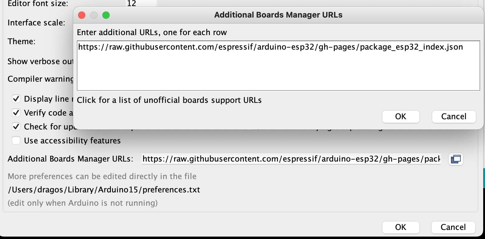
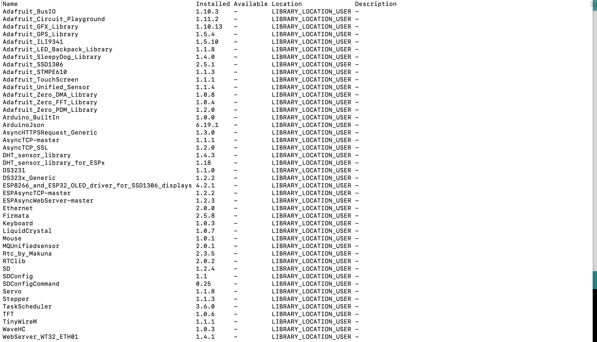
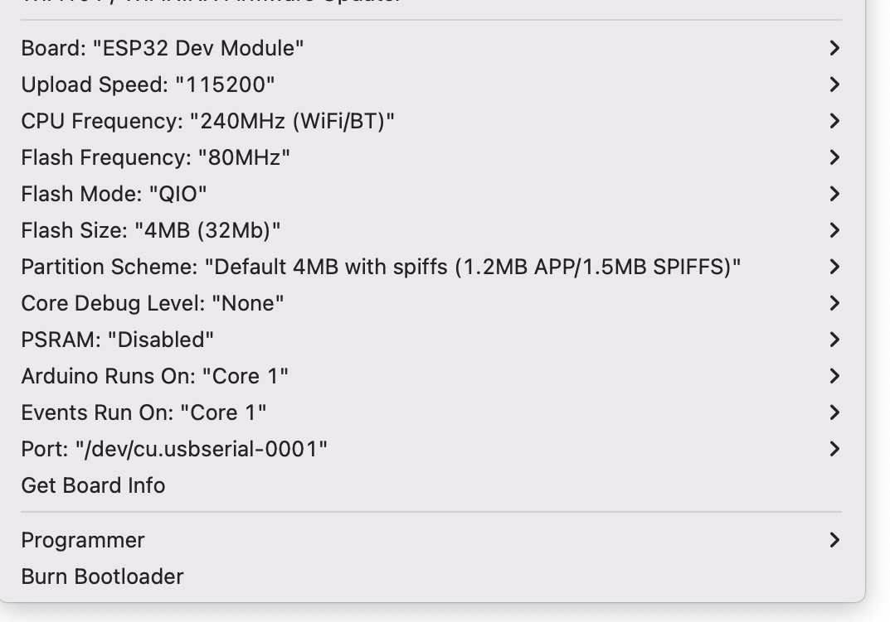

# AirQuality monitoring with ESP32
Air Quality, Temperature, Humidity IoT platform with ESP32

## Introduction

This is a prototype for a station that is monitoring the following parameters:
- Temperature in °C, if you use F please change accordingly in the code
- Humidity in %
- Air Quality in ppm. The sensor measures: CO, Alcohol, CO2, Tolueno, NH4, and Acetona

The device will store the measured data on SD card and is programmed to send data to uBeac, as IoT data collection platform.

The main microcontroller is ESP32 (WROOM-32) and it has the follwing peripherals:
- MQ135 air quality sensor
- DHT22 temperature and humidity sensor
- microSD card reader
- DS3231 RTC clock
- SSD1306 OLED display

Most of the components were purchased from [AZ-Delivery](https://www.az-delivery.de/en) and [Amazon](https://www.amazon.de/)

## What can you find in this repository?

### AQ

Contains the Arduino code. I used Arduino v1.8.19 desktop on a MacBook.
Extra repository configuraiton:

This is the official repository provided by Expressif - the manufacturer of the ESP32 chipset.

List of libraries:


Some libraries were downloaded and installed manually.

Board configuration:


Build the code and upload it into device via USB cable. You need USB to microUSB cable.

### Fritzing

The Fritzing schema. You can find the electronic schema and the breadboard prototype. The PCB was generated by Fritzing but not used for the actual implementation and soldering.

I used an one hole PCB card 7x9 cm for the final soldering of components.

### SD_card

This folder must be copied onto the SD card before you start the Air Quality monitoring station. You have an **index.html** file that will be served by the local web server. The web server is accessible via the IP displayed on OLED.  
The system log file is also stored on the SD card - see file **airquality.log**. This file can be accessed via the local web sever.  

The most important file is the **aq.cfg** this contains the configuration that will initialize the system. You **must** provide an **WiFi SSID** so that the device can connect and start monitoring. Additionally you can send the data to [uBeac](https://ubeac.io). Please follow the instructions on uBeac site in order to create the propper configuration and include it in **aq.cfg**.

## How does it work?
You need to build the physical device before starting. You can either use a breadboard with wires or solder the components on a PCB. I do recommend to start with breadboard first. Use fritzing schema to build the device.

Step 0.   
Format the SD card as fat. I used a 16GB microSD card. The speed of the card is not important.

Step 1.  
Edit aq.cfg file accordingly before copying. Copy the files from forder SD_card to your microSD card. 

Step 2.  
Copile and upload the AQ.ino on ESP32 board.

The device must boot and show a message on OLED that looks like:
```
WiFi SSID [OK]
uBeac setup [OK]
DHT22 [OK]
MQ135 [OK]
AQ monitoring [OK]
IP: 192.168.178.58
```

You can use the serial monitor from Ardunio to see the verbouse log. This is an excellent tool for debugging and troubleshooting.

:four_leaf_clover: Wish you best of luck! :four_leaf_clover: